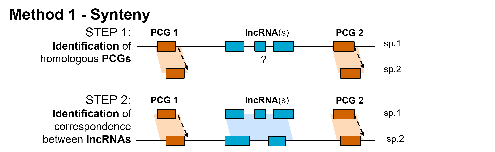
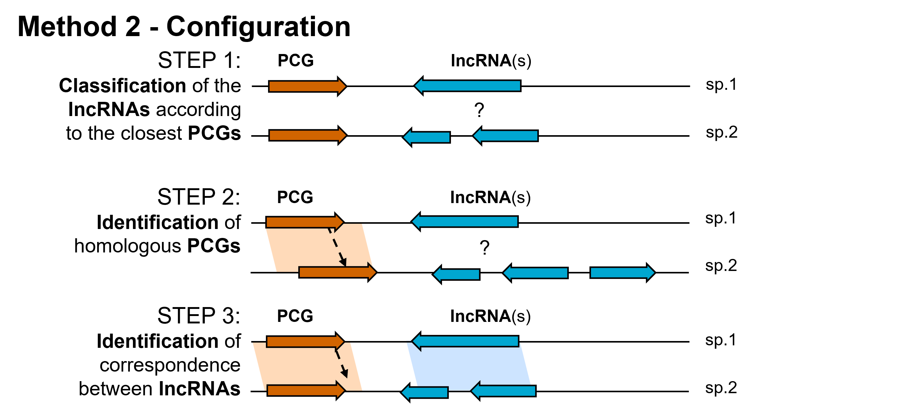

# lncRNA_OrthoFind (WIP) :


This document is intended to describe the lncRNA_Orthofind workflow for identifying potential orthologous lncRNAs between two (or more) species using three methods (corresponding to the three modules) combining synteny, lncRNA-PCG pair genomic configuration and alignment.

 
 - [Introduction](https://gitlab.com/f.degalez/lncrna_orhtologfinder#introduction)
 - [Input files](https://gitlab.com/f.degalez/lncrna_orhtologfinder#input-files)
 - [Installation](https://gitlab.com/f.degalez/lncrna_orhtologfinder#installation-and-requirements) 
 - [lncRNA_OrthoFind modules](https://gitlab.com/f.degalez/lncrna_orhtologfinder#lncrna_orthofind-module)
   -  [synteny](https://gitlab.com/f.degalez/lncrna_orhtologfinder#1-syntenybash)
   -  [configuration](https://gitlab.com/f.degalez/lncrna_orhtologfinder#2-configurationbash)
   -  [alignementMP](https://gitlab.com/f.degalez/lncrna_orhtologfinder#3-alignementmpbash)
 - [Citation](https://gitlab.com/f.degalez/lncrna_orhtologfinder#citation)	
 - [Questions/Comments/bug](https://gitlab.com/f.degalez/lncrna_orhtologfinder#comment-questions-bugs)


## Introduction

Currently, lncRNA_OrthoFind is composed of **3 modules**.
The approach adopted for each module is detailed below, but briefly : 

    * : 1_synteny.bash : Orthology using two PCGs themselves homologous and flanking the lncRNA of interest
    * : 2_configuration.bash : Orthology by studying the configuration of the lncRNA of interest with its associated PCG
    * : 3_alignementMP.bash : Mercator-Pecan alignment of the lncRNA of interest in another species

Each module can be launched independently or together. 

## Input files

Two types of files are needed to correctly used the different modules. These files are the same for each modules. 

1. For each species you will need a file describing genes, transcripts, exons in a **GTF** (=GFF2) format.  
\* *Note: Information about the format can be found [here](https://www.ensembl.org/info/website/upload/gff.html). For the moment, GFF files are not accepted but different conversion tools exist as [gffread](https://github.com/gpertea/gffread)*

2. A **config.txt** files following the template provided (see the 0_files_and_templates directory). 
This file is used for multiple analaysis (_i.e._ if the number of species is > 2) and is composed of three columns.
    - 1. A short name (choose by user, but the common name of the species is oftenly used - _e.g._ "human"/"mouse"/"chicken")
    - 2. The scientific name used by the Ensembl database (see the available list provided - equivalenceName_ensembl.xlsx - _e.g._ "human → hsapiens"/"mouse → mmusculus"/"chicken → ggallus")
    - 3. The **absolute path** of the associated GTF file.


## Installation and requirements

### Requirements

The following software and libraries must be installed :

- [Perl5+](https://www.perl.org/) : tested with version 5.32.1
    - [Ensembl API](https://www.ensembl.org/info/docs/api/api_installation.html) : tested with e! v104  
    - [Bioperl](http://www.bioperl.org/wiki/Main_Page) : tested with version 1.7.8  
    - [TimeHiRes](https://metacpan.org/pod/Time::HiRes) : tested with version 1.9764      

\-

- [R](https://cran.r-project.org/) : test with version 3.5.2 - 2018-12-20 - Eggshell Igloo
    R libraries : 
	- [BiomaRt](https://bioconductor.org/packages/release/bioc/html/biomaRt.html) v2.38.0 or more - Interface to BioMart databases (i.e Ensembl). 
    - [stringr](https://cloud.r-project.org/web/packages/stringr/index.html) v1.4.0 or more - Simple, Consistent Wrappers for Common String Operations. 
    - [stringi](https://cran.r-project.org/web/packages/stringi/index.html) v1.2.4 or more  - Character String Processing Facilities.  

\- 

- [FEELnc](https://github.com/tderrien/FEELnc) : test with version 0.2 - 2020-11-12
    - [FEELnc_classifier.pl](https://github.com/tderrien/FEELnc#3--feelnc_classifierpl) : Classify lncRNAs based on their genomic localization with others transcripts.
    - [FEELnc_tpLevel2gnLevelClassifcation.R](https://github.com/tderrien/FEELnc/blob/master/scripts/FEELnc_tpLevel2gnLevelClassification.R) : Transformation of transcript-level configurations to gene-level models. 


### Installation

To use this workflow just download the directory by clicking on the downloading button in the top right corner. 
You can also clone it using the git clone command : 
```
git clone https://gitlab.com/f.degalez/lncrna_orhtologfinder
```


## lncRNA_OrthoFind modules


### Shared outputs by all three methods  

For the moment, all species are analyzed by pair. That means that if you provided 3 species in the config file, 6 analysis will be performed.  
For each module, in their associated directory, a sub-directory named **B_results** is created and contained all the results for each analysis.  
In this sub-directory, an other sub_directory nammed **"sp1_comparedTo_sp2"** is created and contains all the files associated to the species-couple.  


### Shared outputs by the first two methods  
Considering the two first methods, different cases of orthology can be identified as :
- **one_to_zero** : the lncRNA (1) from the source genome do not have any (0) syntenic equivalent in the target genome
- **many_to_zero** : multiple lncRNAs (N) from the source genome do not have any (0) syntenic equivalent in the target genome
- **one_to_one** : the lncRNA (1) from the source genome have a unique (1) syntenic lncRNA equivalent in the target genome
- **many_to_many** : multiple lncRNAs (N) from the source genome have mulitple (N) syntenic lncRNAs equivalent in the target genome
- **many_to_one** : multiple lncRNAs (N) from the source genome have a unique (1) syntenic lncRNA equivalent in the target genome
- **one_to_many** : the lncRNA (1) from the source genome have mulitple (N) syntenic lncRNA equivalent in the target genome

<div align="center">


</div>


### 1) First method : Synteny

The first module of the workflow allows the search for potentially orthologous lncRNAs between species by considering neighboring PCGs. Indeed, for each lncRNA, the closest PCGs (_resp._ downstream & upstream) are identified and their orthologs are determined for all species. Orthologous PCGs in the target species then delineate a loci that may contain lncRNAs and that can potentially be orthologous considering the target species.

<div align="center">



</div>

- **INPUT** :  
    - The config file in the correct format (see the file **"config_exempleFile.txt"**)

```
# Usage:
bash 1_generationMulti_synteny.bash [CONFIG FILE ABSOLUTE PATH]
```

N.B (1) : In order to detect the genes' biotypes, two regular expressions are used. _"protein_coding"_ for PCGs and _"antisense|lincRNA|lncRNA|sense_exonic|sense_intronic"_ for lncRNAs. If you use a custom GTF file or want to add a specific biotype, it is possible to modify these regular expressions by changing the lines at the beginning of the 2_creationTable.R module located in 1_synteny/A_modules/ (This option will be added in a future update)

N.B (2) : Sometimes a message "Ensembl site unresponsive" can appear. This is independent of the program and indicates that the Ensemble database that is used cannot be accessed. It is possible to use the mirror site by changing this parameter in the "0_creationBiomartFile.R" module. 

- **OUTPUT** :  
In each sub-directory "sp1_comparedTo_sp2", there is : 
	- For both species :  
        - The GTF containing only the gene features (which are used for the analysis)
        - The table containing the lncRNAs and their associated PCGs
	- For the intersection : 
        - The homology file for the PCGs provided by BioMart
        - The orthology table results (orthology_strandConservation.tsv)

<ins>Details about the orthology table :</ins>  
The file is the result of the concatenation of three sub-tables.  
The **first sub-table** provides information about the lncRNAs identified as potential orthologs in the source species and contains: 
- the ID(s) of the lncRNAs and the IDs of the PCGs up and down  
- the respective orientation of the lncRNAs and PCGs  
- the relative configuration of the lncRNA with respect to the two PCGs  (see ""method1_relativeConfigurationfile.png"")
- the distance of the lncRNA from the two PCGs  


The **second sub-table** brings the same information for the orthologous lncRNAs of the target species.   

The **last sub-table** brings the information of orthology stricto sensu, that means: 
- the type of orthology (see figure "Shared outputs by the first two methods  ")
- the type of conservation of the orientation (class and group, see method1_strandManagement.png)
 

### 2) Second method : Configuration

The second module of the workflow allows the search for potentially orthologous lncRNAs between species by considering configuration with the associated PCG (here we consider lncRNA-PCG couple). To understand how the configuration is calculated, you can look at the [FEELnc documentation](https://github.com/tderrien/FEELnc).  

<div align="center">



</div>

Considering that all the species doesn't have the same level of annotation, the strictness apply to the configuration association can be leveled. In order to do that, we proposed 5 levels of strictness (see the FEELnc_configEquivalence.xlsx file and the fig XX for the equivalence). Briefly : 
- **strict** : Correspond to the configuration system proposed by FEELnc _i.e._ including the configuration at the gene and at the transcript level
- **inter1** : Consider only the gene configuration level
- **inter2** : Consider three cases as convergent / antisense / divergent and distinguish between the genic and intergenic lncRNAs
- **open1**: Consider three cases as convergent / antisense / divergent without any disinction
- **open2**: Only consider antisense and divergent cases  

\\

- **INPUT** : 
    - The config file in the correct format (see the file **"config_exempleFile.txt"**)
    - The type of configuration strictness you want to apply. (see the file **"FEELnc_configEquivalence.xlsx"**)

```
# Usage:
bash 2_generationMulti_configurationFEELnc.bash [CONFIG FILE ABSOLUTE PATH] [configNamming]
```
N.B (1) : In order to detect the genes' biotypes, two regular expressions are used. _"protein_coding"_ for PCGs and _"antisense|lincRNA|lncRNA|sense_exonic|sense_intronic"_ for lncRNAs. If you use a custom GTF file or want to add a specific biotype, it is possible to modify these regular expressions by changing the lines at the beginning of the 0_FEELnc_classifier_adapted.bash module located in 2_configuration_FEELnc/A_modules/ (This option will be added in a future update)

N.B (2) : Depending on the accuracy of the genome annotation, FEELnc may take more or less time to complete. A part of the program allows not to repeat this operation for the different crosses. However, in order to save more time, if the FEELnc files have already been generated (in an annex analysis for example) it is possible to use them by placing them in the 2_configuration_FEELnc/B_results/feelNC_data folder (can be created if it's not already the case) and naming them as {shortName}_lncConfiguration_feelncclassifier.tsv


- **OUTPUT** :  
In each sub-directory "sp1_comparedTo_sp2", there is : 
   - For both species :  
       - The table provided by FEELnc at the gene level and containing the configuration for all the lncRNA associated to their PCG.
   - For the intersection : 
       - The homology file for the PCGs provided by BioMart
       - The orthology table results (lncConfigurationHomology_concatenated.tsv)  


<ins>Details about the orthology table :</ins> 
The file is the result of the concatenation of three sub-tables.
The **first sub-table** provides information about the lncRNAs identified as potential orthologs in the source species and contains :
- the ID(s) of the lncRNAs and the ID of the PCG
- the configuration of the lncRNAs and PCG according to the level of strictness
- the class of the lncRNAs (see the FEELnc documentation for more information)
- the distance of the lncRNA from the PCG
The second sub-table brings the same information for the orthologous lncRNAs of the target species.

The **last sub-table** brings the information of orthologous stricto sensu, that means: 
- the type of orthology (see figure "Outputs shared by the first two methods")

### 3) Third method : Alignment (MP)
The third module of the workflow considers the totality of the lncRNAs of the source species and attempts to align them using the Mercator-Pecan algorithm to the target species. 
→ For the moment (integration of the Mercator-Pecan alignment algorithm will be done) the Compara database of Ensembl is used. Therefore, the lncRNA which will be aligned are thus wich are extracted from the GTF from Ensembl. It's impossible for the moment to align lncRNA from a custom GTF. One alternative is to watch if an other target species with an annotation from Ensembl match your custom GTF (i.e. in "target" species)

In some cases, the alignment can be done in several more or less separate blocks. Depending on the level of rigor desired, the maximum distance accepted between these blocks can be adjusted. In a classical way, we use a distance of 500bp. However, so that alignments divided into several blocks are not considered, it is possible to consider a distance of 0

<div align="center">


</div>

- **INPUT** :  
    - The config file in the correct format (see the template provided)
```
# Usage:
#bash 3_generationMulti_alignementMP.bash [CONFIG FILE ABSOLUTE PATH] [sizeBlockAuthorized]
```

N.B (1) : In order to detect the genes' biotypes, two regular expressions are used. _"protein_coding"_ for PCGs and _"antisense|lincRNA|lncRNA|sense_exonic|sense_intronic"_ for lncRNAs. If you use a custom GTF file or want to add a specific biotype, it is possible to modify these regular expressions by changing the lines at the beginning of the 1_extraction_listLNC.bash module located in 3_alignement_MP/A_modules/ (This option will be added in a future update)

N.B (2) : Depending on the accuracy of the genome annotation, the extraction from the Compara DB may take more or less time to complete. A part of the program allows not to repeat this operation for the different crosses. However, in order to save more time, if the files have already been generated (in an annex analysis for example) it is possible to use them by placing them in the 3_alignement_MP/B_results/Compara_data folder (can be created if it's not already the case) and naming them as {shortName}_alignement_MP_63amniotes

- **OUTPUT** :  
In each sub-directory "sp1_comparedTo_sp2", there is : 
    - For the source species : 
        - The list of the lncRNA id used
        - A directory containing the alignment results for all the lncRNAs (1 file per alignement / open it only if it's necessary)
    - For the target species : 
        - The GTF containing only the gene features
    - For both species : 
        - The matching table results (sp1_alignedTo_sp2.tsv)


<ins>The matching table contains :  </ins>  
- the ID of the lncRNA
- An indication of matching (0 = No match / 1 = Match / -1 = Matching but in several blocks with a gapped larger than expected)
- the gnId of the features which are mathcing in the target specie
- the corresponding biotype of these features
- An indication of the presence of at least one lncRNA in the matching features.


## Authors

- DEGALEZ Fabien
- LAGARRIGUE Sandrine

## Versions

- Current version : 0.2
- Old versions : unavailable

## Citation

Unavailable

## Comment - Questions - Bugs

List of features that will (maybe) be added/modified :
- Module with options : -- help for each module and other
- Auto conversion of GFF in GTF
- Auto-installation of packages in R
- Auto-update of BioMart + ensembl API
- Changing RegEx
- Mercator Pecan Alignement direct integration
